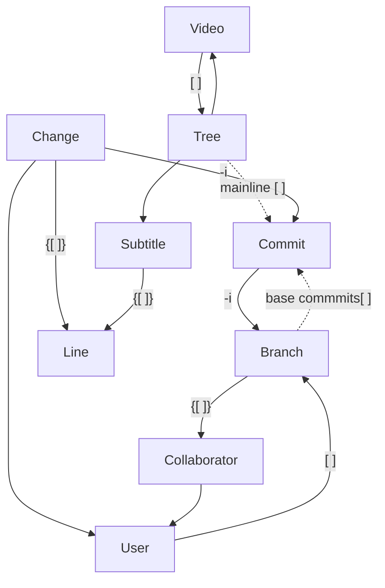

- **-i** = index
- **[ ]** array
-  **{[ ]}** embeded array


```
VideoData {
  SubtitleTrees: Tree[]
}
```
```
Tree {
  Video: Video
  Subtitle: Subtitle,
  Mainline: Commit[]
}
```
```
Branch {
  Collaborators: {Collaborator[]}
  BaseCommits: Commit[]

}
```
```
Commit {
  Branch: Branch, -index
}
```
```
Change {
  Commit: Commit -index
  SubtitleLineIds: {ObjectId[]}
  User: User,
}
```
```
Subtitle {
  Lines:{SubtitleLine[]}
}
```
```
Line {
customId
...
}
```
```
User {
  Branches: Branch[]
}
```
```
Collaborator {
  User: User
}
```
```
Comment {
  Author: User
  Commit: Commit
  Change: Change
}
```
